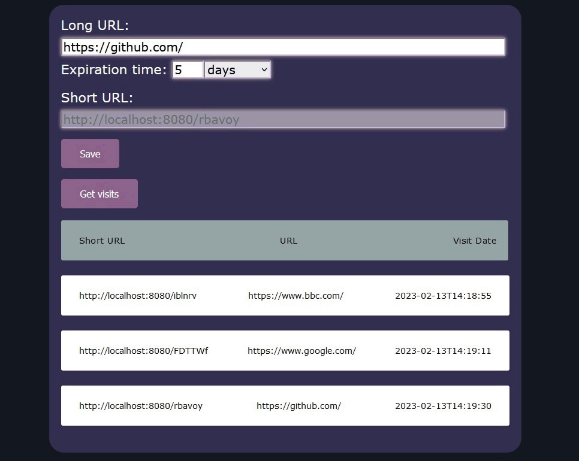

# URL-Shortener

This application generate shortened URL for longer page link and forward you to long URL use shortened URL.

In url-shortener-service folder is REST service based on Spring-boot Framework. Service has input object and output object list. Links are saved in H2 database.

In url-shortener-client folder is Angular client manager which contains input form with visits table.

